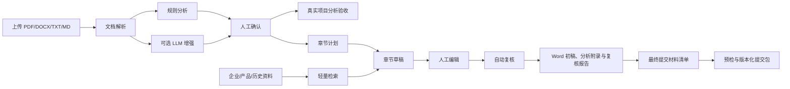

# 投标初稿助手实施方案与项目路径

更新时间：2026-08-04

## 1. 项目定位

本项目定位为“投标初稿助手”，不是完整电子招投标平台，也不承诺无人审核自动出标。对于只有一名主要开发人员的现实条件，第一阶段只解决一条高价值主链路：

> 招标文件上传 → 文档解析 → 要求结构化 → 人工确认 → 企业资料检索 → 章节初稿 → Word 导出 → 提交清单 → 提交打包

采用独立轻量实现，不直接 fork `yibiao` 或照搬完整投标系统。原因是完整系统往往同时包含权限、流程、模板、知识库、协作、合规、任务编排、模型管理和运维等多个子系统，单人开发会长期陷入集成和维护。

## 2. 项目路径

| 内容 | 绝对路径 |
| --- | --- |
| 项目根目录 | `D:\灵坤\投标系统` |
| Web 入口 | `D:\灵坤\投标系统\app.py` |
| 核心代码 | `D:\灵坤\投标系统\bid_assistant` |
| 自动化测试 | `D:\灵坤\投标系统\tests` |
| 示例资料 | `D:\灵坤\投标系统\sample_data` |
| 本地虚拟环境 | `D:\灵坤\投标系统\.venv` |
| 环境配置 | `D:\灵坤\投标系统\.env` |
| 业务数据根目录 | `D:\灵坤\投标系统\data` |
| SQLite 数据库 | `D:\灵坤\投标系统\data\app.db` |
| 项目数据目录 | `D:\灵坤\投标系统\data\projects\<project_id>` |
| 原始方案 PDF | 本机外部只读参考文件，不复制、不提交到代码仓库 |

单项目数据结构如下：

```text
data/projects/<project_id>/
├─ source/                 # 本项目招标源文件
├─ parsed.json             # 文档解析结果
├─ analysis.json           # 结构化分析和人工确认结果
├─ analysis_baseline.json  # 自动分析原始基线
├─ analysis_baseline_meta.json # 基线来源信息
├─ analysis_acceptance.json # 真实项目验收指标、耗时和明细
├─ drafts.json             # 章节草稿
├─ review.json             # 自动复核问题和处理状态
├─ submission_checklist.json # 最终提交材料清单
├─ knowledge/
│  ├─ company/             # 企业资料
│  ├─ product/             # 产品资料
│  └─ history/             # 历史方案
├─ attachments/            # 最终提交附件分类目录
│  ├─ qualification/
│  ├─ business/
│  ├─ technical/
│  ├─ pricing/
│  ├─ signature/
│  └─ other/
├─ versions/drafts/        # 最近 50 个草稿版本快照
├─ versions/exports/       # 最近 50 个 Word 版本元数据
├─ versions/packages/      # 最近 20 个提交包版本元数据
├─ output/                 # 导出的 Word 文件
└─ packages/               # 版本化最终提交 ZIP
```

项目可从界面导出为带清单和 SHA-256 校验的完整 ZIP。备份不包含 `.env`、模型密钥、SQLite 中的其他项目或代码运行环境；导入同名/同 ID 项目时不会覆盖已有数据。

## 3. 当前技术方案



技术栈：

- Python 3.12
- Streamlit：单体 Web 界面，减少前后端分离成本
- Pydantic：分析结果和章节数据校验
- SQLite + 本地文件：项目元数据和文档存储
- pypdf + python-docx：文档解析与 Word 输出
- OpenAI 兼容接口：可接 Ollama 或其他兼容模型服务
- pytest：核心回归测试

模块职责：

| 模块 | 职责 |
| --- | --- |
| `config.py` | 环境变量和数据路径 |
| `models.py` | 结构化数据模型 |
| `parsers.py` | PDF、DOCX、文本解析和扫描件提示 |
| `analyzer.py` | 规则提取、LLM 分析、原文引用校验、目录生成 |
| `acceptance.py` | 自动分析基线对比、真实项目验收指标和中文报告 |
| `knowledge.py` | 知识资料切块与轻量关键词检索 |
| `generator.py` | 规则草稿和 LLM 章节生成 |
| `reviewer.py` | 遗漏、风险、占位符和章节完整性复核 |
| `exporter.py` | 专业 A4 Word 初稿、页眉页脚、原生列表和固定宽度表格导出 |
| `docx_quality.py` | Word 文件完整性、章节和版式结构质检及报告生成 |
| `submission.py` | 最终提交材料同步、分类和完成度统计 |
| `packager.py` | 提交包预检、ZIP 封装、完整性复核和校验报告生成 |
| `storage.py` | SQLite 项目元数据和项目文件存储 |
| `llm.py` | OpenAI 兼容模型客户端 |

## 4. 可复用策略

不复制大型开源系统的完整链路，只复用成熟组件和清晰边界：

1. 文档解析：当前使用 pypdf/python-docx；扫描件成为真实瓶颈后再接 MinerU，并保持 `ParsedDocument` 输出结构不变。
2. 知识检索：当前资料量小，使用本地关键词检索；当单项目资料明显增多、召回质量不足时，再替换为向量库或 RAGFlow 适配器。
3. 模型调用：统一通过 OpenAI 兼容接口，避免业务代码绑定某个模型供应商。
4. 流程编排：当前链路固定且短，不引入 LangGraph 等额外框架；只有出现可恢复的长任务、多分支审批或并行 Agent 时再评估。
5. Word 模板：当前先保证内容完整和结构稳定；获得甲方真实模板后，再实现“字段映射 + 样式模板”适配，不做通用排版引擎。

## 5. 当前版本验收标准

- 规则模式在没有模型服务时可独立运行
- 示例招标文件能提取项目名称、时间、强制要求、评分项和风险
- 人工修改后的分析结果可持久化
- 自动分析基线不得随人工编辑变化，重新分析时旧验收记录必须失效
- 人工确认后可统计命中、误报、人工补充漏项、修改数和待确认数
- 验收报告必须记录明细和耗时，并明确指标仅用于真实项目迭代对比
- 三类知识资料可上传并参与章节生成
- 未找到企业事实依据时，草稿必须出现“待补充”或“待确认”
- Word 文件可被 python-docx 重新打开，包含封面、章节、页码字段和分析附录
- Word 正文、标题、字距、段落间距、表格宽度和页眉页脚使用明确样式参数，不依赖 Word 默认值
- Word 表格不得裁切内容或跨页拆分单行，跨页表格必须重复表头
- Word 导出前必须显示检查清单；未处理风险需要人工确认，历史文件不得被静默覆盖
- 每个 Word 版本必须保留生成时间、风险摘要、版本说明和文件校验值
- Word 历史版本下载和提交打包前必须重新验证 SHA-256、DOCX 必要结构和正文章节数量
- 非 A4、文件损坏、哈希变化或章节缺失属于阻断项；字体、字距、行距、页眉页脚、表格和占位符属于提示项
- Word 质检失败时不得提供文件下载，但应允许下载中文质检报告
- 招标分析中的所需材料可同步为最终提交清单，人工状态、附件关联和备注不得在同步时丢失
- 提交附件必须分类保存且同名文件不得静默覆盖；项目备份包含附件，项目复制排除附件和提交清单
- 必交项全部已备妥或明确不适用后，项目总进度才将提交清单标记为完成
- 提交包生成前必须检查 Word 版本、清单保存状态、必交项和附件断链；结构性问题不得通过人工确认绕过
- 存在未处理复核问题时只能生成明确标记的内部预审包
- 提交包必须包含所选 Word、分类附件、CSV 清单、说明和逐文件 SHA-256 清单
- 提交包使用 `P001` 递增版本并保留最近 20 版，项目备份包含提交包，项目复制不携带提交包
- 下载提交包前必须重新校验外层 SHA-256、ZIP 路径、清单与实际文件集合、逐文件大小和哈希
- 校验失败时不得提供提交包下载，但应允许导出包含错误项和文件明细的校验报告
- 核心模块测试通过，Streamlit 页面可以在本机启动

## 6. 单人开发路线

### 第一阶段：可演示 MVP（当前）

- 打通完整主链路
- 规则模式兜底
- 固定 Word 输出
- 建立测试和示例数据
- 用 2 至 3 份真实招标文件做人工对照

### 第二阶段：提高招标分析可靠性

- 增加表格和章节边界识别
- 已支持长文档分段 LLM 分析、部分失败保留和结果去重合并
- 已在分析与复核页面保留原文页码、引用和关联条目
- 已增加项目信息遗漏、待确认条款、废标风险、缺失章节和正文占位符检查
- 已检查工期、交付期、质保期、金额、日期、人员数量和资质有效期的跨章节冲突
- 接入 MinerU 处理扫描件和复杂版式

### 第三阶段：提高复用与交付效率

- 已增加项目归档、恢复、八阶段进度总览和完整 ZIP 备份迁移
- 已增加项目复制，并排除旧 Word 输出和旧版本历史
- 已增加草稿自动版本快照、章节预览和安全恢复
- 已增加 Word 导出前检查、风险确认、递增版本命名和历史版本下载
- 已增加最终提交清单、附件目录、提交包预检和版本化打包
- 企业资料预索引，避免每次生成重复解析
- 建立少量经过验证的章节模板
- 适配 1 至 2 个真实 Word 模板

### 暂缓事项

- 多租户和复杂权限
- 在线多人协同编辑
- 通用工作流设计器
- 自动盖章和签名
- 全网数据采集
- 全行业、全格式的模板平台

## 7. 建议工作节奏

单人开发时，每次迭代只用一份真实招标文件验证一个主要问题。优先级固定为：

1. 不漏关键条款和废标风险
2. 不编造企业事实
3. 分析结果可追溯到原文
4. 草稿能减少人工整理时间
5. 最后再优化排版和界面

只有当当前版本能在真实项目中稳定节省时间，才扩展 OCR、向量库、复杂模板和多 Agent。这样可以控制系统规模，也能让每一步都有明确收益。

## 8. 启动与维护

### 8.1 本地模型部署

当前落地方案使用 Windows 原生 `llama.cpp` Vulkan 服务，不依赖 Ollama、Docker 或 WSL。运行时位于 `runtime\llama.cpp`，模型位于 `models\qwen3-4b`，两者均不进入 Git。

首次安装或重建：

```powershell
.\setup_local_llm.ps1
```

安装脚本从国内 GitHub 代理获取固定版本运行时，从 ModelScope 获取 `Qwen3-4B-Q4_K_M.gguf`，支持断点续传，并分别按官方 SHA-256 校验。校验失败的文件不会作为正式模型启动。

独立启动、停止模型服务：

```powershell
.\start_local_llm.ps1
.\stop_local_llm.ps1
```

默认服务地址为 `http://127.0.0.1:11434/v1`，模型别名为 `qwen3:4b`，本地 API Key 为 `ollama`。服务只监听本机地址并限制 CORS 来源；`run.ps1` 在启动 Streamlit 前会自动检查并启动该服务。

首次安装：

```powershell
Set-Location -LiteralPath 'D:\灵坤\投标系统'
python -m venv .venv
.\.venv\Scripts\python.exe -m pip install -r requirements.txt
Copy-Item .env.example .env
```

启动：

```powershell
.\run.ps1
```

测试：

```powershell
.\.venv\Scripts\python.exe -m pytest -q
```

单项目迁移可在左侧“项目管理”中下载和导入完整 ZIP；整机灾备仍应备份项目源码和 `data` 目录。`.venv` 可以随时根据 `requirements.txt` 重建，不需要进入备份。

## 9. 2026-08-04 验证记录

- Python 静态编译通过
- `pip check` 通过，无依赖冲突
- 43 项自动化测试全部通过
- 示例招标文件解析成功：330 字符、2 条强制要求、2 个评分项、2 个风险项
- 规则模式生成 6 个章节草稿
- 示例 Word 成功生成并由 python-docx 重新打开，包含 199 个段落和分析附录
- 示例输出：`D:\灵坤\投标系统\data\demo\示例投标文件初稿.docx`
- V2 Word 已包含自动复核附录：20 个待处理问题、6 个高风险、2 个表格
- V2 示例输出：`D:\灵坤\投标系统\data\demo\示例投标文件初稿V2.docx`
- V3 Word 已完成中文 A4 专业排版：宋体正文、微软雅黑标题、明确字距和段落间距、首页不同、左右页眉页脚、固定宽度表格和禁止单行跨页拆分
- V3 经 Microsoft Word 原生导出 PDF，并逐页检查 16 页 PNG，无裁切、重叠和表格断行
- V3 示例输出：`D:\灵坤\投标系统\data\demo\示例投标文件初稿V3.docx`
- Streamlit 健康检查：`http://127.0.0.1:8501/_stcore/health` 返回 `200 / ok`
- 本地访问地址：`http://127.0.0.1:8501`

## 10. 第二阶段增量

- LLM 按页组织并分段处理；默认每段约 12000 字、最多 12 段，参数可在模型配置中调整
- 单个 LLM 分段失败时保留其他成功分段，不直接丢弃全部结果
- 新增复核检查页，复核状态可持久化到 `review.json`
- Word 导出新增自动复核报告附录
- 知识资料未变化时复用解析切块缓存，文件修改后自动失效
- 新增 GitHub Actions，在 `main` 分支 push 和 Pull Request 时自动编译并运行测试

## 11. 第三阶段首批增量

- SQLite 自动迁移项目归档字段，现有数据库无需手工处理
- 项目支持归档、恢复和归档筛选
- 根据项目实际文件计算六阶段进度，不依赖单一状态字符串
- 项目完整 ZIP 可迁移源文件、结构化结果、知识资料、草稿、复核状态和输出文件
- ZIP 导入检查路径穿越、重复文件、符号链接、加密内容、文件数量、解压体积和 SHA-256
- 导入发生 ID 冲突时自动使用新 ID，任何校验失败都不会登记不完整项目
- 开发与验证记录统一维护在 `开发实现日志.md`

## 12. 第四阶段首批增量

- 复核新增预算/最高限价、投标报价、投标截止时间和开标时间一致性检查
- 金额统一换算为元，日期统一为标准日期时间后比较，减少格式差异误报
- 按项目经理、技术人员、售后人员等具体角色分别检查人员数量
- 按 ISO、CMMI、ITSS 等具体资质名称检查有效期冲突
- 项目可快速复制业务数据，副本不携带旧 Word 和旧草稿版本
- 草稿生成、人工保存时自动建立版本快照，最多保留最近 50 个版本
- 恢复旧版本前自动保存当前正文，并使旧复核报告失效
- Word 输出采用 A4 中文投标文件样式，正文、标题、字距、段落间距和列表编号均使用明确参数
- 封面启用首页不同，项目信息固定列宽，正文页眉页脚稳定左右对齐
- 评分表和复核表采用固定宽度、重复表头、垂直居中、单元格留白和禁止行拆分
- 复核表合并问题与建议列，并通过紧凑但可读的四列版式控制跨页效果

## 13. 第四阶段第二批增量

- 导出页显示六类检查结果，集中呈现基本信息、章节、高风险、占位符、证据和复核进度
- 无章节草稿时禁止导出，存在警告时必须确认本次文件仅用于内部复核
- Word 文件采用 `V001` 起始的递增版本号，每次生成新文件并保留旧版本
- Word 版本元数据保存章节数、待处理及各风险级别数量、版本说明、文件大小和 SHA-256
- 界面显示历史 Word 版本表，并允许选择任意版本下载
- 每个项目最多保留最近 50 个 Word 版本，项目复制时不携带旧输出，完整备份则包含全部版本

## 14. 第四阶段第三批增量

- 新增第七阶段“提交清单”，从分析结果同步未忽略的所需材料
- 清单支持人工增删、六类材料分类、必交标记、准备状态、原文页码、附件关联和备注
- 新增资格、商务、技术、报价、签章装订和其他附件目录，支持上传、下载和移除
- 同名附件自动追加序号，避免覆盖已有材料；附件删除后清单显示断链提醒
- 最终提交清单支持导出带 UTF-8 BOM 的 CSV，便于使用 Excel 复核和打印
- 完整项目备份包含附件和清单，项目副本不携带项目专属提交材料

## 15. 第四阶段第四批增量

- 项目流程扩展为八阶段，新增“提交打包”完成状态
- 提交包预检集中检查 Word 版本、清单是否存在、未保存编辑、必交项和附件断链
- 未处理复核问题作为需确认风险，不绕过结构性阻断；确认后生成的包明确标记为仅内部预审
- 可选择任意历史 Word 版本，与当前已保存清单和六类附件一起生成 ZIP
- ZIP 内含最终提交材料清单、提交包说明和 `package-manifest.json`
- 校验清单记录每个内容文件的相对路径、大小和 SHA-256，自动化测试逐项复算校验
- 提交包使用 `P001`、`P002` 递增命名，记录 Word 来源、清单摘要、附件数、风险数、用途和版本说明
- 每个项目保留最近 20 个提交包；完整备份保留文件及版本元数据，复制项目时排除旧提交产物

## 16. 第四阶段第五批增量

- 新增提交包独立校验器，不信任文件扩展名或生成时状态，下载前重新读取 ZIP
- 校验版本记录中的外层 SHA-256，识别提交包在生成后被替换或修改的情况
- 拒绝路径穿越、绝对路径、Windows 盘符、重复路径、符号链接、加密文件和超限 ZIP
- 对比 `package-manifest.json` 与实际文件集合，识别缺失文件、未登记文件和重复记录
- 逐文件复算大小和 SHA-256，并核对唯一 Word 文件、Word 来源信息和 CSV 的 UTF-8 BOM
- 检查材料清单是否保持完成状态，以及待处理复核问题是否正确标记为内部预审
- 校验失败时界面禁用 ZIP 下载；无论成功或失败均可下载中文校验报告
- 校验结果按文件路径、预期哈希、文件大小和修改时间缓存，文件变化后自动重新计算

## 17. 第四阶段第六批增量

- 新增 Word 成品独立质检模块，对历史版本下载和提交打包使用同一套结果
- 重新计算 Word SHA-256，识别导出后被替换或修改的历史版本
- 检查 DOCX ZIP 结构及 `[Content_Types].xml`、`word/document.xml`、`word/styles.xml`
- 使用 python-docx 重新打开文件并核对记录章节数，章节缺失时阻止下载和打包
- 检查所有分节是否为 A4 纵向，并提示页边距是否偏离系统标准
- 检查宋体 10.5 磅、1.5 倍行距、标题字符间距、页码字段和首页不同
- 检查正文表格固定宽度、禁止单行跨页拆分，以及文档中的待补充/待确认内容
- Word 文件损坏或结构不完整时禁用下载；提示项可继续下载，但进入提交包时需要确认仅内部预审
- 支持下载带 BOM 的中文 Word 质检报告，记录结构检查、错误项、提示项和实际哈希

## 18. V1.0 首批增量

- 每次规则或 LLM 分析完成时保存 `analysis_baseline.json`，人工编辑不覆盖原始基线
- 单独保存基线来源；旧项目当前结果建立的基线只能统计后续变化，不冒充自动分析原始结果
- 基线记录解析结果指纹；当前解析文件变化但尚未重新分析时，禁止形成验收记录
- 重新分析或再次保存人工确认结果时，自动使旧验收记录失效
- 按稳定条目 ID 对比基线和人工确认结果，区分确认命中、忽略/删除、人工补充和待确认
- 记录人工修改原提取项的数量，辅助定位提取内容或原文引用需要修正的情况
- 计算已审核项命中率；仅在全部条目复核完成后计算覆盖率估算
- 支持记录纯人工预计耗时、系统协助实际耗时、验收人和人工备注
- 分析表格存在未保存修改时，暂停验收记录保存和报告下载，避免数据版本不一致
- 生成带 UTF-8 BOM 的中文验收报告，包含指标、耗时、命中、误报、漏项和待确认明细
- 验收基线与记录随项目复制和完整 ZIP 备份迁移，用于累计 2 至 3 份真实文件样本
